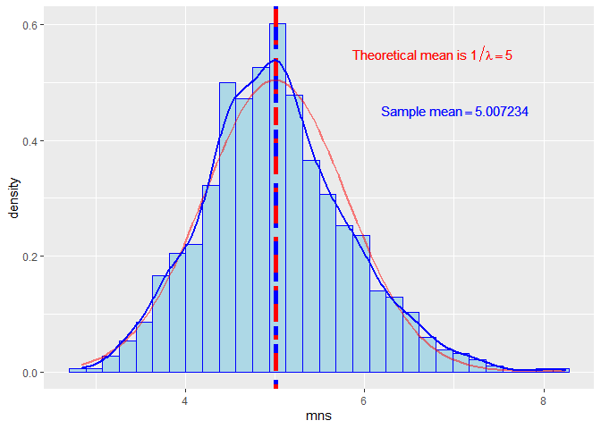

## Overview

In this analysis we will investigate the exponential distribution and compare it with the Central Limit Theorem. We will set lambda = 0.2 for all of the simulations. We will investigate the distribution of averages of 40 exponentials over a thousand simulations.    

## Simulations  

Setting the variables for lambda, the total number of simulations, the number of exponentials. The seed is setted to 588 in order to make this analysis reproducible.


```r
lambda = 0.2
n = 1000
exp = 40
set.seed(588)
mns = NULL
```

Simulating the data and calculating the mean of each simulation.


```r
for(i in 1:n) mns = c(mns,mean(rexp(40,lambda)))
```

## Sample Mean vs Theoretical Mean  

The **sample mean** is  


```r
(sampleMean = mean(mns))
```

```
## [1] 5.007234
```

The **theoretical mean** is  


```r
(theoreticalMean=1/lambda)
```

```
## [1] 5
```

The **disparity** between the theoretical and the sample mean is  

```r
printf("%.4f %%",100*(1-theoreticalMean/sampleMean))
```

```
## 0.1445 %
```

## Sample Variance versus Theoretical Variance  
The **sample variance** is  


```r
(sampleVar = var(mns))
```

```
## [1] 0.6447373
```

The **theoretical variance** is  


```r
(theoreticalVar=(1/lambda)^2/exp)
```

```
## [1] 0.625
```
The **disparity between** the theoretical and the sample variance is  

```r
printf("%.4f %%",100*(1-theoreticalVar/sampleVar))
```

```
## 3.0613 %
```
## Distribution


```r
labelSampleMean <- bquote(Sample~mean==.(sampleMean))
labelTheoreticalMean <- bquote(Theoretical~mean~is~1/lambda==.(theoreticalMean))
#  expression(paste("Theoretical mean=1/",lambda,"=",v.1))
mnsDF <- data.frame(mns)
g <- ggplot(mnsDF,aes(mns))
g + geom_histogram(aes(y=..density..),color="blue",
                   fill="lightblue",bins=30) +
    geom_vline(aes(xintercept=mean(mns)),
               color="blue",size=2,
               linetype="twodash") + 
    annotate(geom = "text", x=mean(mns)*1.35,y=.55,
             label=labelTheoreticalMean, color= "red",
             alpha= 0.7 ) + 
    geom_vline(aes(xintercept=sampleMean),
               color="red",size=2,
               linetype="dotdash") + 
    annotate(geom = "text", x=mean(mns)*1.4,y=.45,
             label=labelSampleMean, color= "blue",
             alpha= 0.7 ) +
    stat_function(fun = dnorm,
            args=list(mean=1/lambda,sd=theoreticalVar^(1/2)),
              color = "red",size=1, alpha=.5) +
    geom_density(color = "blue",size=1,alpha=.5)
```

<!-- -->

As we can see in the plot above, the density of the simulation (<span style='color: blue;'>blue line</span>) is similar to the density of a normal distribution (<span style='color: red;'>red line</span>). Also the means (vertical lines, <span style='color: blue;'>blue for the sample mean</span> and <span style='color: red;'>red for the theoretical</span>) are overlapped because they are pretty similar.
