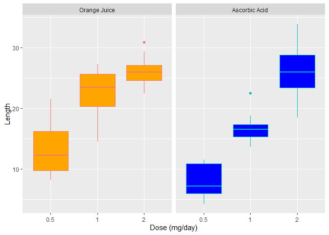

## Overview  

The data we are going to use is a study of the effect of vitamin C on tooth growth in guinea pig.  

## Summary of the data  

We are going to see the structure and a quick view to the data.

```r
data("ToothGrowth")
str(ToothGrowth)
```

```
## 'data.frame':	60 obs. of  3 variables:
##  $ len : num  4.2 11.5 7.3 5.8 6.4 10 11.2 11.2 5.2 7 ...
##  $ supp: Factor w/ 2 levels "OJ","VC": 2 2 2 2 2 2 2 2 2 2 ...
##  $ dose: num  0.5 0.5 0.5 0.5 0.5 0.5 0.5 0.5 0.5 0.5 ...
```
The tooth length 

```r
summary(ToothGrowth$len)
```

```
##    Min. 1st Qu.  Median    Mean 3rd Qu.    Max. 
##    4.20   13.07   19.25   18.81   25.27   33.90
```
The dose were 0.5, 1, 2 in miligrams/day.  
The supplement type were coded as <span style='color: orange;'>OJ</span>,<span style='color: blue;'>VC</span> and they mean <span style='color: orange;'>orange juice</span> or <span style='color: blue;'>ascorbic acid</span> (a form of vitamin C).  

## Comparation   


```r
levels(ToothGrowth$supp) <- c("Orange Juice", "Ascorbic Acid")
ToothGrowth$dose <- as.factor(ToothGrowth$dose)
g <- ggplot(ToothGrowth, 
            aes(x = dose, y = len, color = supp))
g + facet_grid(. ~ supp) + 
  geom_boxplot( aes(fill = supp),show.legend = F) +
  scale_fill_manual(values = c("orange", "blue")) +
  xlab("Dose (mg/day)") + ylab("Length")
```

<!-- -->

## Hypothesis Tests  

### H0: Both delivery modes of Vitamin C have the same influence on tooth growth. 


```r
len <- ToothGrowth$len
supp <- ToothGrowth$supp
dose <- ToothGrowth$dose
t1 <- t.test(len[supp=="Orange Juice"],
             len[supp=="Ascorbic Acid"],
             paired=F,conf.level = 0.95)
```

The confidence interval is -0.1710156, 7.5710156 with a confidence level of 95 % and the p-value is 0.0606345 greather than 0.05.  
We do not reject the null hypothesis.  

### H1 With a dose of 0.5 mg/day the two delivery methods have the same influence on tooth growth.  

```r
t2 <- t.test(len[supp=="Orange Juice" & dose==0.5] ,
             len[supp=="Ascorbic Acid" & dose==0.5],
             paired=F, conf.level = 0.95)
```

The confidence interval is 1.7190573, 8.7809427 with a confidence level of 95 % and the p-value is 0.0063586 much lower than 0.05.  
We  reject the null hypothesis.  

### H2 With a dose of 1 mg/day the two delivery methods have the same influence on tooth growth.  

```r
t2 <- t.test(len[supp=="Orange Juice" & dose==1] ,
             len[supp=="Ascorbic Acid" & dose==1], 
             paired=F, conf.level = 0.95)
```

The confidence interval is 2.8021482, 9.0578518 with a confidence level of 95 % and the p-value is 0.0010384 much lower than 0.05.  
We  reject the null hypothesis.  

### H3 With a dose of 2 mg/day the two delivery methods have the same influence on tooth growth.  

```r
t2 <- t.test(len[supp=="Orange Juice" & dose==2] ,
             len[supp=="Ascorbic Acid" & dose==2],
             paired=F, conf.level = 0.95)
```

The confidence interval is -3.7980705, 3.6380705 with a confidence level of 95 % and the p-value is 0.9638516 greather than 0.05.  
We  do not reject the null hypothesis.

## Conclusion  
#### **<span style='color: orange;'>Orange Juice</span>** has more influence on tooth growth with a dose < 2 mg/day compared to **<span style='color: blue;'>Ascorbic Acid</span>**.  
#### With a dose of 2 mg/day both delivery methods have the same influence.
